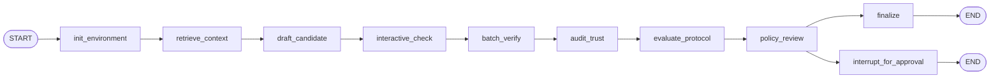

# Runtime graph

The LangGraph state machine for patch admissibility and multi-agent obligations. For the full workflow and use cases, see [workflow.md](../workflow.md).

**Initial state:** Build via `make_initial_state()` from `lean_langchain_orchestrator.runtime.initial_state`. The factory accepts `thread_id`, `obligation_id`, `obligation`, `target_files`, optional `target_declarations`, `current_patch`, `repo_path`, `session_id`, `policy_pack_name`, `protocol_events`, and `**overrides`.

**State fields (key)**

| Field | Purpose |
|-------|---------|
| protocol_events | Optional list of protocol events; when non-empty, evaluate_protocol runs before policy_review. |
| policy_pack_name | Pack name (e.g. strict_patch_gate_v1, reviewer_gated_execution_v1). |
| obligation.policy.protected_paths | Paths that require review when touched; used for patch_metadata. |
| policy_decision | Set by evaluate_protocol or policy_review. |
| status | accepted, rejected, failed, awaiting_approval, repairing, auditing. |

## State

- **protocol_events** (optional): List of protocol events (claim, delegate, lock, release, approve, execute, recover, etc.) produced during the run. When non-empty, the `evaluate_protocol` node runs all pack-enabled protocol checks (handoff_legality, lock_ownership_invariant, delegation_admissibility, state_transition_preservation, artifact_admissibility, side_effect_authorization, evidence_complete_execution_token) and can set `policy_decision` to rejected/blocked before `policy_review`.
- **policy_pack_name** (optional): Pack name for policy_review and reviewer_gated check (e.g. `strict_patch_gate_v1`, `reviewer_gated_execution_v1`). When the pack has `reviewer_gated_execution`, the graph requires `approval_decision` (approval token) before policy_review can yield accepted.
- **obligation.policy.protected_paths** (optional): List of paths that require review when touched. Used with `current_patch` to compute patch_metadata via `summarize_patch`.

## Nodes and flow

- After `audit_trust`, **evaluate_protocol** runs when `protocol_events` is non-empty: it evaluates each pack-enabled obligation class and, if any result is rejected/blocked, sets `policy_decision` so that the run terminates without overwriting in policy_review.
- **policy_review** loads the pack by name, computes patch_metadata from `summarize_patch`, and passes it to the policy engine. If the pack has `reviewer_gated_execution` and `approval_decision` is not set (approved/rejected), it returns blocked with reason `missing_approval_token`. It preserves any existing `policy_decision` from evaluate_protocol (rejected/blocked) and does not overwrite it.
- **interrupt_for_approval** builds the review payload including `patch_metadata` (current_patch, protected_paths_touched, imports_changed, changed_files, diff_hash) for the Gateway.

## Patch metadata

The graph computes patch_metadata from runtime state in `policy_review` and `interrupt_for_approval`: `before={}`, `after=current_patch`, `protected_paths=obligation.policy.protected_paths`. Result includes `protected_paths_touched`, `imports_changed`, `changed_files`, `diff_hash`. This is passed to the policy engine and into the review payload.

## Run status

The graph sets `status` on state. Terminal or in-progress values include: `accepted`, `rejected`, `failed`, `awaiting_approval`, `repairing`, `auditing`. Integration tests assert that the final state status is one of these after a run.

## Handoff events and CLI

- Events can be supplied at invocation time via state (e.g. `protocol_events` in the initial state) or via the CLI: `obr run-patch-obligation --protocol-events-file events.json` passes the JSON array of events into state; the graph’s evaluate_protocol node runs all pack-enabled protocol checks (handoff_legality, lock_ownership_invariant); first rejection/block wins. Use `--protected-paths` to set `obligation.policy.protected_paths` so that touching those paths triggers needs_review and the review payload includes patch_metadata. The CLI `obr run-protocol-obligation --events-file` remains the entry point for offline protocol evaluation. Reason codes and decisions are in `packages/policy/lean_langchain_policy/constants.py`.

**See also:** [workflow.md](../workflow.md), [gateway-api.md](gateway-api.md), [policy-model.md](policy-model.md), [review-surface.md](review-surface.md).
