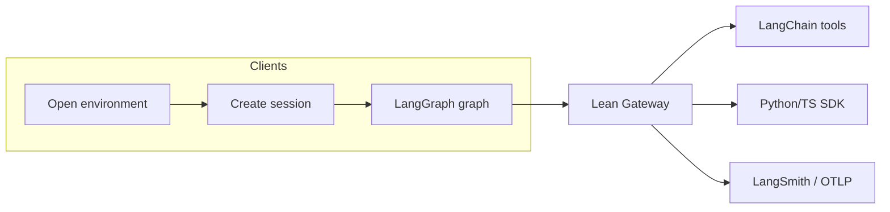

# Workflow and integrations

The runtime runs a formal obligation pipeline: open a Lean environment, run verification, evaluate policy, and optionally pause for human review. The orchestrator (CLI or API) drives a LangGraph state machine that calls the Lean Gateway via the SDK; LangChain tools expose the same operations for agents; LangSmith and OTLP record traces. Key terms are in [glossary.md](glossary.md).

**Concepts at a glance**

| Term | Definition | Link |
|------|------------|------|
| **Obligation** | Formally checkable claim (e.g. patch admissibility). | [glossary](glossary.md) |
| **WitnessBundle** | Evidence produced on every accepted run. | [glossary](glossary.md) |
| **acceptance lane** | Batch verify (lake build, axiom audit, fresh checker); the only final gate. | [acceptance-lane.md](architecture/acceptance-lane.md) |
| **interactive lane** | Per-file Lean check; informs repair, never the final gate. | [interactive-lane.md](architecture/interactive-lane.md) |
| **policy pack** | Versioned config (protected paths, reviewer gating). | [policy-model.md](architecture/policy-model.md) |
| **Resume run** | Continue the graph after approve/reject; requires checkpointer. | [review-surface.md](architecture/review-surface.md) |

**Table of contents**

- [1. End-to-end workflow](#1-end-to-end-workflow)
- [2. Use cases](#2-use-cases)
- [3. LangChain integration](#3-langchain-integration)
- [4. LangSmith integration](#4-langsmith-integration)
- [5. LangGraph integration](#5-langgraph-integration)
- [6. Tests: mapping to workflow and integrations](#6-tests-mapping-to-workflow-and-integrations)
- [See also](#see-also)

---

## 1. End-to-end workflow

### Overview

The runtime implements a **formal obligation pipeline**: open a Lean environment, create a session, run interactive and batch verification, evaluate policy, and optionally interrupt for human review before finalizing. The flow is driven by the **orchestrator** (CLI or API) and executed by the **LangGraph** patch-admissibility graph, which calls the **Lean Gateway** via the **Python/TypeScript SDK**. **LangChain tools** expose the same Gateway operations so agents can run the same steps. **LangSmith** (and optional OTLP) record traces and support experiments and regression evaluation.

```
┌─────────────────────────────────────────────────────────────────────────────────┐
│                           LEAN-LANGCHAIN WORKFLOW                               │
├─────────────────────────────────────────────────────────────────────────────────┤
│                                                                                 │
│  ┌──────────────┐    ┌──────────────┐    ┌──────────────────────────────────┐   │
│  │ Open         │    │ Create       │    │ LangGraph: init → interactive    │   │
│  │ environment   │───►│ session      │───►│ check → batch_verify → audit    │   │
│  │ (fingerprint) │    │ (session_id) │    │ → policy_review → finalize      │   │
│  └──────────────┘    └──────────────┘    └──────────────────────────────────┘   │
│         │                    │                            │                     │
│         │                    │                            │                     │
│         ▼                    ▼                            ▼                     │
│  ┌──────────────────────────────────────────────────────────────────────────┐   │
│  │ LEAN GATEWAY (HTTP API)                                                  │   │
│  │ POST /v1/environments/open | POST /v1/sessions | apply-patch |           │   │
│  │ interactive-check | batch-verify | GET/POST /v1/reviews/{id} (resume)    │   │
│  └──────────────────────────────────────────────────────────────────────────┘   │
│         │                    │                            │                     │
│         ▼                    ▼                            ▼                     │
│  ┌──────────────┐    ┌──────────────┐    ┌──────────────────────────────────┐   │
│  │ LangChain    │    │ Python/TS    │    │ LangSmith / OTLP                 │   │
│  │ tools        │    │ SDK          │    │ (spans, runs, datasets, compare) │   │
│  │ (agent API)  │    │ (graph/CLI)  │    │                                  │   │
│  └──────────────┘    └──────────────┘    └──────────────────────────────────┘   │
│                                                                                 │
└─────────────────────────────────────────────────────────────────────────────────┘
```



### Step-by-step (patch admissibility)

1. **Open environment**  
   Client (CLI, SDK, or tool) calls `POST /v1/environments/open` with `repo_id`, `repo_path` (or `repo_url`), and optional `commit_sha`. Gateway returns `fingerprint_id` and optionally full `fingerprint`. This pins the Lean/Lake environment used for all subsequent checks.

2. **Create session**  
   Client calls `POST /v1/sessions` with `fingerprint_id`. Gateway creates a session bound to that environment and returns `session_id`. All apply-patch, interactive-check, and batch-verify calls in this flow use this `session_id`.

3. **Apply patch (optional)**  
   If the obligation has a candidate patch, client calls `POST /v1/sessions/{session_id}/apply-patch` with `files: { path: content }`. The patch is applied in the session overlay; interactive and batch checks run on this state.

4. **Interactive check**  
   The graph (or a tool) calls `POST /v1/sessions/{session_id}/interactive-check` with `file_path`. Gateway runs the interactive Lean check (LSP or subprocess build) and returns `ok`, `diagnostics`, `goals`, and optionally `lsp_required: true` if LSP is not configured. The graph routes on this result: if not `ok` or if there are goals with text, it may go to repair; otherwise it proceeds to batch verify.

5. **Batch verify**  
   Client calls `POST /v1/sessions/{session_id}/batch-verify` with `target_files` and optionally `target_declarations`. Gateway runs lake build, axiom audit, and fresh checker (production requires real; tests inject test doubles via conftest), and returns `ok`, `trust_level`, `build`, `axiom_audit`, `fresh_checker`, `reasons`, and evidence flags `axiom_evidence_real`, `fresh_evidence_real`. This is the **authoritative acceptance lane**; interactive is never the final gate.

6. **Audit and protocol**  
   The graph runs `audit_trust` and, if `protocol_events` are present, `evaluate_protocol` (handoff legality, lock ownership, etc.). Any rejection/block from protocol sets `policy_decision` and can terminate the run.

7. **Policy review**  
   The graph runs `policy_review`: loads the policy pack (e.g. `strict_patch_gate_v1`, `reviewer_gated_execution_v1`), computes `patch_metadata` (e.g. `protected_paths_touched`), and calls the policy engine. If the pack is reviewer-gated and no `approval_decision` is set, policy returns blocked with `missing_approval_token`. Otherwise the engine returns accepted, rejected, blocked, or needs_review.

8. **Interrupt for approval (if needs_review)**  
   When policy returns `needs_review`, the graph calls `interrupt_for_approval`: it builds a review payload (patch_metadata, diagnostics, axiom/batch summaries, reasons) and posts it to the Gateway via `create_pending_review`. The graph then stops with status `awaiting_approval`. A human (or automated reviewer) uses the Review UI or API to approve/reject; then the client calls `POST /v1/reviews/{thread_id}/resume` (or `obr resume <thread_id>`) to continue. Resume requires a **checkpointer** (e.g. Postgres); the graph loads state and routes to `resume_with_approval` then `finalize` or end.

9. **Finalize**  
   The graph builds a **WitnessBundle** (environment fingerprint, interactive result, batch result, policy decision, approval if any) and appends it to artifacts, then sets status to `accepted` (or `rejected` if approval was reject). Every terminal successful run produces at least one witness bundle.

### Where this is implemented

| Layer            | Implementation |
|------------------|----------------|
| Gateway API      | `apps/lean-gateway`: routes for environments, sessions, apply-patch, interactive-check, batch-verify, reviews (payload, approve, reject, resume). Paths are defined in `lean_langchain_schemas.api_paths` and used by both gateway and SDK. |
| Graph            | `apps/orchestrator`: import `build_patch_admissibility_graph`, `ObligationRuntimeState`, `make_initial_state` from `lean_langchain_orchestrator`. Implementation in `runtime/graph.py`; initial state via `runtime/initial_state.py`. |
| CLI              | `apps/orchestrator/lean_langchain_orchestrator/cli.py`: `open-environment`, `create-session`, `run-patch-obligation`, `resume`, etc. Uses `make_initial_state()` for run-patch-obligation. |
| SDK              | `packages/sdk-py`: import `ObligationRuntimeClient`, `RequestAdapter` from `lean_langchain_sdk`. Client uses path constants from `lean_langchain_schemas.api_paths`. Responses are validated **Pydantic models** (OpenAPI-aligned); use attributes or `model_dump(mode="json")` for dicts. |
| Tools            | `packages/tools/lean_langchain_tools/toolset.py`: `build_toolset`; fixed tool order documented in docstring and in [integrate.md](integrate.md) (Public API). |

### Candidate producer (optional)

The patch is always supplied by the caller (CLI, SDK, or script); the graph never generates Lean. For custom patch sources, an optional **candidate producer** can propose a patch before the run: implement the `CandidateProducer` protocol (`propose_patch(context) -> dict[str, str]`) and pass the result into state as `current_patch`, then invoke the same graph. The producer interface lives in `lean_langchain_orchestrator.producer` (`ProducerContext`, `CandidateProducer`, `context_from_state`). Implement in adapters or a companion repo; the core verification path is unchanged.

---

## 2. Use cases

### 2.1 Patch admissibility (first pilot)

**Goal:** Propose a patch, run the obligation graph, get accepted or rejected with a witness bundle.

**Flow:** Open environment → create session → run patch obligation (graph runs interactive check, batch verify, policy, finalize). No protected paths, no reviewer gate. Terminal status is `accepted` or `rejected`/`failed`; artifacts include a witness bundle.

**Expected outcome:** Terminal status `accepted` or `rejected`/`failed`; when accepted, `artifacts_count` >= 1 and artifacts include a WitnessBundle.

**Docs:** [demos/README.md](demos/README.md) (scenario 1 and commands).  
**Tests:** `tests/integration/test_graph_runtime.py::test_graph_builds_and_runs_to_terminal`, `scripts/demos/run_demo_scenario_1.py`, `tests/integration/test_acceptance_lane.py`. Integration tests use shared fixtures from `tests/conftest.py` (`gateway_app`, `gateway_client`) and `tests/integration/conftest.py` (`sdk_client`, `obr_graph`, `make_testclient_request_adapter`).

### 2.2 Patch with sorry or axiom failure => rejected

**Goal:** Ensure patches that introduce `sorry` or fail axiom/fresh checks are rejected.

**Flow:** Same as 2.1, but the patch (or batch result) leads to policy rejection.

**Expected outcome:** Terminal status `rejected` or `failed`; reasons may include batch/axiom/fresh failure.

**Docs:** `docs/demos/README.md` (scenario 2).  
**Tests:** `tests/integration/test_acceptance_lane.py` (Prompt 04 families), `tests/unit/test_batch_combine.py` (strict acceptance).

### 2.3 Protected path => needs_review and resume

**Goal:** When the patch touches protected paths, policy returns `needs_review`; the graph interrupts and pushes the review payload; after human approve/reject, resume continues the graph.

**Flow:** Obligation has `policy.protected_paths`; `current_patch` touches one of them. Policy returns `needs_review`; graph runs `interrupt_for_approval`, posts payload to Gateway, stops at `awaiting_approval`. User approves (or rejects) via Review UI or API, then calls resume. With Postgres checkpointer, a second process (or UI) can call resume and the graph continues to finalize or end.

**Expected outcome:** After interrupt, status `awaiting_approval`; after approve + resume, status `accepted` (or `rejected` if human rejected).

**Docs:** `docs/demos/README.md` (scenario 3), `docs/architecture/review-surface.md`.  
**Tests:** `tests/integration/test_graph_runtime.py::test_graph_protected_path_touched_reaches_needs_review`, `test_graph_protected_path_review_payload_has_patch_metadata`, `tests/integration/test_interrupt_resume.py`, `tests/integration/test_review_resume_flow.py`.

### 2.4 Reviewer-gated execution (no approval token => blocked)

**Goal:** For packs that require an approval token (e.g. `reviewer_gated_execution_v1`), if the run has no `approval_decision`, policy blocks with `missing_approval_token`.

**Flow:** Graph runs with `policy_pack_name: reviewer_gated_execution_v1` and no `approval_decision`. After `policy_review`, decision is `blocked`, reasons include `REASON_MISSING_APPROVAL_TOKEN`.

**Expected outcome:** `policy_decision` is `blocked`; reasons include `missing_approval_token`.

**Docs:** `docs/architecture/reviewer-gated-execution.md`, `docs/demos/README.md` (scenario 5).  
**Tests:** `tests/integration/test_graph_runtime.py::test_graph_reviewer_gated_blocks_without_approval_token`, `scripts/demos/run_demo_scenario_5.py`.

### 2.5 Protocol obligations (handoff, lock, etc.)

**Goal:** Evaluate multi-agent protocol obligations (handoff legality, lock ownership, delegation, etc.) from a list of events, without running the full Lean pipeline.

**Flow:** Client calls `obr run-protocol-obligation` (or equivalent) with `--obligation-class`, `--pack`, and `--events-file`. The protocol evaluator runs the pack’s enabled checks on the events and returns decision/reasons. The **graph** can also run `evaluate_protocol` when `protocol_events` is non-empty before `policy_review`.

**Expected outcome:** Decision (e.g. `accepted`, `rejected`, `blocked`) and reasons per obligation class and event sequence.

**Docs:** `docs/architecture/multi-agent-protocol.md`, `docs/demos/README.md` (handoff legality, lock ownership).  
**Tests:** Regression fixtures and protocol evaluator tests; `tests/integration/test_langsmith_fixed_corpus.py` uses protocol runnable with regression corpus.

### 2.6 Regressions and golden cases

**Goal:** Run a fixed corpus of inputs and assert expected decisions/trust levels (patch and multi-agent families).

**Flow:** `obr regressions` (or test suite) loads fixtures from `packages/evals/lean_langchain_evals/fixtures.py` and `tests/regressions/fixtures/`, runs policy/protocol (and optionally full graph), and asserts against canonical reason codes and decisions.

**Expected outcome:** All golden cases pass; decisions and reasons match fixture expectations.

**Docs:** `docs/runbooks/evaluation.md`, `docs/demos/README.md`.  
**Tests:** `tests/regressions/`, regression fixtures, `tests/integration/test_langsmith_fixed_corpus.py`.

---

## 3. LangChain integration

### Role

LangChain **tools** are the **execution boundary** for agents: they expose the same operations as the Gateway API (open environment, create session, apply patch, interactive check, batch verify, get review payload, submit review decision). Agents can thus drive the same workflow as the CLI or SDK without calling HTTP directly.

### Toolset

Implemented in `packages/tools/lean_langchain_tools/toolset.py`. `build_toolset(base_url, client)` returns a list of tools:

| Tool                     | Purpose |
|--------------------------|--------|
| `open_environment_tool`  | Open or reuse environment; returns `fingerprint_id`. |
| `create_session_tool`   | Create session for a fingerprint; returns `session_id`. |
| `apply_patch_tool`       | Apply file patch in session overlay. |
| `check_interactive_tool` | Run interactive Lean check for a file. |
| `get_goal_tool`          | Get goal at position (LSP or empty when test double / no LSP). |
| `hover_tool`             | Hover at position. |
| `definition_tool`       | Definition at position. |
| `batch_verify_tool`     | Run batch verification (authoritative lane). |
| `get_review_payload_tool`| Get review payload for a thread. |
| `submit_review_decision_tool` | Submit approve/reject. |

The SDK client used by the tools can be passed in (e.g. with a custom request adapter for tests) or built from `base_url`.

### How agents use the tools

An agent (or chain) receives a task (e.g. “verify this patch”). It can call:

1. `open_environment_tool(repo_id=..., repo_path=...)` → `fingerprint_id`
2. `create_session_tool(fingerprint_id=...)` → `session_id`
3. Optionally `apply_patch_tool(session_id=..., files={...})`
4. `check_interactive_tool(session_id=..., file_path=...)` to get diagnostics/goals
5. `batch_verify_tool(session_id=..., target_files=[...], target_declarations=[])` to get the final acceptance result

If the run is in `awaiting_approval`, the agent (or a separate “reviewer” agent) can use `get_review_payload_tool` and `submit_review_decision_tool`, and then resume is done via API/CLI (resume is not a tool in the current toolset but can be added).

### MCP adapter

The MCP adapter exposes the same session-bound operations so that Cursor or other MCP clients can open environments, create sessions, apply patches, and run checks. Session affinity is preserved by passing `session_id` (and optionally `thread_id`) through the MCP boundary. See `docs/architecture/mcp-adapter.md`.

### Tests

- **Integration:** `tests/integration/test_tools.py` — builds toolset with TestClient-backed SDK, invokes open_environment → create_session → apply_patch → check_interactive → batch_verify, and asserts on result structure. This validates that the LangChain tools correctly drive the Gateway flow.
- **Session affinity:** `tests/integration/test_mcp_session_affinity.py` — same flow via MCP tools and session context.

---

## 4. LangSmith integration

### Role

LangSmith is the **trace and evaluation plane**: runs and spans are sent to LangSmith when configured; datasets and experiments support regression and A/B evaluation; helpers support comparing runs and promoting traces to datasets.

### Tracer

The graph (and runtime) accept an optional `tracer`. When provided, each node enter/exit (and error) is emitted as an event. The telemetry package supports:

- **In-memory:** Default in tests; events stored in process.
- **OTLP:** Set `OBR_OTLP_ENDPOINT` (or `OTEL_EXPORTER_OTLP_ENDPOINT`); install `lean-langchain-telemetry[otlp]`. Spans are exported via OTLP (e.g. to Jaeger/Collector).
- **LangSmith:** Set `LANGCHAIN_API_KEY` (or `LANGCHAIN_TRACING_V2`); install `lean-langchain-telemetry[langsmith]`. `LangSmithTracer` sends run-like data to LangSmith.

`get_production_tracer()` returns the configured tracer or `None`; the graph uses it for node-level spans. See `packages/telemetry/lean_langchain_telemetry/README.md` and `docs/architecture/telemetry-and-evals.md`.

### Datasets and experiments

- **create_dataset(name, description, examples)** — Create a LangSmith dataset; optionally add examples. Used to define a fixed corpus (e.g. regression inputs). Returns `status: "error"` with a message if SDK missing or auth fails.
- **run_experiment(dataset_name, runnable, experiment_prefix)** — Run a runnable (e.g. patch-admissibility or protocol runnable) over a dataset via `run_on_dataset`; records an experiment. Used for “experiments on a fixed corpus.”
- **patch_admissibility_runnable_factory** — Returns a runnable that takes `obligation_input` (and optional `protocol_events`, `obligation_class`, `pack_name`), runs the protocol evaluator (or minimal path), and returns decision/trust_level/reasons. Compatible with `run_on_dataset` for protocol/regression experiments.

### Evaluator comparison and trace promotion

- **compare_runs(run_ids)** — Fetches two or more LangSmith runs via `read_run`, returns a structured comparison (inputs, outputs, error, latency_ms per run, summary). Use for A/B or evaluator run comparison. Returns `status: "error"` with a message if SDK missing or fewer than two run IDs.
- **trace_to_dataset(trace_ids, dataset_name)** — Promotes selected run IDs to a dataset: resolve or create dataset by name, then for each trace call `read_run` and `create_example_from_run`. Use to build a dataset from production or experiment traces for later evaluation. Returns `status: "error"` with a message when SDK missing or auth fails.

### Tests

- **Unit:** `tests/unit/test_langsmith.py` — create_dataset, run_experiment (including fixed-corpus), compare_runs (with mocked client), trace_to_dataset (with mocked client). Assert return structure and error/created/run/compare/promoted status.
- **Integration:** `tests/integration/test_langsmith_fixed_corpus.py` — Load regression fixtures (e.g. multi_agent_*.json), build examples, create_dataset, run_experiment with patch_admissibility_runnable_factory; assert no unhandled exception and status in (run, error). Validates end-to-end experiment-on-corpus path.
- **Tracer:** `tests/unit/test_production_tracer.py` — get_production_tracer (env and deps), OtlpTracer.emit, LangSmithTracer.emit (mocked). `tests/integration/test_tracer_e2e_otlp.py` — E2E with InMemorySpanExporter to verify span emission and reception.

---

## 5. LangGraph integration

### Role

LangGraph is the **Lean-LangChain runtime**: it implements the patch-admissibility state machine that orchestrates init, interactive check, batch verify, audit, protocol evaluation, policy review, interrupt for approval, and finalize. The graph uses the SDK client to call the Gateway; it does not call Lean directly.

### State

State is `ObligationRuntimeState` (typed dict): `thread_id`, `obligation_id`, `obligation`, `session_id`, `environment_fingerprint`, `target_files`, `target_declarations`, `current_patch`, `patch_history`, `interactive_result`, `goal_snapshots`, `batch_result`, `policy_decision`, `trust_level`, `approval_required`, `approval_decision`, `status`, `attempt_count`, `max_attempts`, `artifacts`, `trace_events`, and internal `_repo_path`, `policy_pack_name`, `protocol_events`. See `apps/orchestrator/lean_langchain_orchestrator/runtime/state.py` and `docs/architecture/runtime-graph.md`.

### Nodes and edges

- **START** → conditional: if `approval_required` and `approval_decision` in (approved, rejected) → `resume_with_approval`; else → `init_environment`.
- **init_environment** → open_environment + create_session via client; set `session_id`, `environment_fingerprint` → **retrieve_context** → **draft_candidate** → **interactive_check** (apply patch if any, then interactive_check via client).
- **interactive_check** → conditional: no result or not ok → repair; goals with text → repair; else → **batch_verify**.
- **batch_verify** → client.batch_verify → **audit_trust** → **evaluate_protocol** (if protocol_events) → **policy_review**.
- **policy_review** → conditional: accepted → **finalize**; needs_review → **interrupt_for_approval**; else → END.
- **interrupt_for_approval** → create_pending_review via client → END (status awaiting_approval).
- **resume_with_approval** → conditional: approved → **finalize**; else → END.
- **finalize** → build WitnessBundle, append to artifacts, set status accepted → END.
- Repair nodes (repair_from_diagnostics, repair_from_goals) → END (minimal: set status and end; future: retry or fail).

When a **checkpointer** is provided (e.g. PostgresSaver), the graph state is persisted so that a second invocation (e.g. after approve + resume) can load state and continue from `resume_with_approval`.

### Tracing

Each node is wrapped with `_with_tracing(tracer, node_name, fn)`: on enter and exit (and on exception) an event is emitted with `event_type`, `span_name`, `thread_id`, `obligation_id`, `node_name`, `status`, `timing_ms`, etc. Span names are defined in `SPAN_BY_NODE` (e.g. `obr.init_environment`, `obr.interactive_check`).

### Tests

- **tests/integration/test_graph_runtime.py:**
  - **test_graph_builds_and_runs_to_terminal** — Build graph with TestClient-backed SDK, invoke with minimal state; assert terminal status (accepted/rejected/failed/awaiting_approval/repairing/auditing) and, if accepted, presence of witness bundle in artifacts.
  - **test_graph_reviewer_gated_blocks_without_approval_token** — Pack `reviewer_gated_execution_v1`, no approval_decision; assert policy_decision blocked and reason `missing_approval_token`.
  - **test_graph_protected_path_touched_reaches_needs_review** — Obligation with protected_paths and current_patch touching it; assert status `awaiting_approval` and policy decision `needs_review`, reasons include protected_path_touched.
  - **test_graph_protected_path_review_payload_has_patch_metadata** — Same setup; capture create_pending_review payload; assert patch_metadata.protected_paths_touched is truthy.

These tests validate the full LangGraph flow against the Gateway (mocked or real) and the policy/interrupt/resume behavior. See also `tests/integration/test_interrupt_resume.py` for in-process resume with MemorySaver and `tests/integration/test_review_resume_flow.py` for resume endpoint error handling.

---

## 6. Tests: mapping to workflow and integrations

| Test file / area              | Workflow step / use case              | Integration        |
|------------------------------|----------------------------------------|--------------------|
| test_acceptance_lane.py       | Batch verify, evidence flags, strict  | Gateway            |
| test_graph_runtime.py        | Full graph, reviewer-gated, protected | LangGraph, Gateway |
| test_full_demo.py     | Full demo: valid edit, sorry, false theorem, protected approve/reject | LangGraph, Gateway |
| test_full_demo_script.py | Demo script: --help, gateway unreachable skip, flags | Subprocess         |
| test_tools.py                | Open → session → apply → check → batch | LangChain tools    |
| test_mcp_session_affinity.py | Session-bound flow via MCP            | LangChain/MCP       |
| test_review_resume_flow.py    | Resume endpoint, errors                | Gateway, graph     |
| test_interrupt_resume.py     | Interrupt + resume in-process         | LangGraph          |
| test_langsmith.py             | create_dataset, run_experiment, compare_runs, trace_to_dataset | LangSmith          |
| test_langsmith_fixed_corpus.py| Experiment on regression corpus        | LangSmith          |
| test_production_tracer.py    | get_production_tracer, Otlp/LangSmith emit | Telemetry      |
| test_tracer_e2e_otlp.py      | Span emission and reception            | OTLP               |
| test_batch_combine.py        | apply_acceptance_strict                | Gateway batch      |
| test_axiom_audit.py          | Test double and real axiom audit, NON_REAL_AXIOM_AUDIT_REASON | Gateway            |
| test_gateway_api.py          | Health, ready, metrics                | Gateway            |
| test_gateway_production.py   | redact_secrets, _assert_production_state | Gateway         |
| Regressions                  | Golden decisions/reasons              | Policy, protocol   |

Running the full test suite (unit + integration) validates workflow steps, use cases 2.1–2.6, and LangChain, LangSmith, and LangGraph integrations as described above. See [tests-and-ci.md](tests-and-ci.md) for CI jobs and optional jobs (langsmith, telemetry-e2e, etc.).

---

## See also

- [architecture/core-primitives.md](architecture/core-primitives.md), [glossary.md](glossary.md) — Core primitives, key terms
- [architecture/runtime-graph.md](architecture/runtime-graph.md) — LangGraph nodes and state
- [architecture/gateway-api.md](architecture/gateway-api.md) — Lean Gateway HTTP API
- [integrate.md](integrate.md) — Integration tiers and public API
- [running.md](running.md) — Run Gateway, CLI, Review UI; env vars
- [glossary.md](glossary.md) — Key terms
